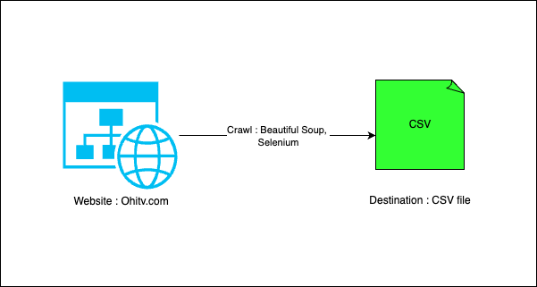
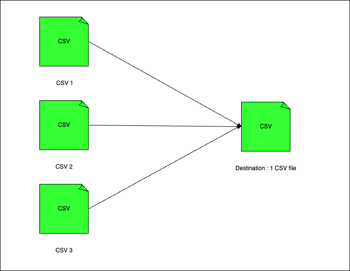

# Assignment

## What in Assignment

1. [Online vs Offline Extraction](#online-vs-offline-extraction)
    - [Definition](#definition)
    - [Online Extraction](#online-extraction)
    - [Offline Extraction](#offline-extraction)
    - [Similarity](#similarity)
    - [Difference](#difference)

2. [ETL vs ELT](#etl-vs-elt)
    - [Definition](#definition-1)
    - [ETL](#etl)
    - [ELT](#elt)
    - [Similarity](#similarity-1)
    - [Difference](#difference-1)

3. [Virtual Environment vs Virtual Machine vs Container](#ve-vm-con)
    - [Virtual Environment](#ve)
    - [Virtual Machine](#vm)
    - [Container](#con)
    - [Similarity](#similarity-2)
    - [Difference](#difference-2)

## Online vs Offline Extraction
### Definition
- **Online Extraction** : Typically refers to the process of retrieving specific information or data from a digital source in real-time or near-real-time. It involves extracting relevant data from various online platforms, such as websites, databases, social media, or any other digital sources where information is stored or updated regularly.

- **Offline Extraction** : Refers to the process of retrieving specific information or data from sources that are not directly connected to the internet or are not actively updated in real-time. Unlike online extraction, which involves accessing digital sources in real-time or near-real-time, offline extraction involves accessing data that has been previously stored or collected and is typically static or updated less frequently.

### Online Extraction
- **Characteristics**

    - **Real-Time Analysis**: Samples are collected and analyzed in real-time or near real-time.
    - **Automated Systems**: Often involves automated systems that can continuously or periodically sample and analyze.
    - **Integration**: Typically integrated directly with analytical instruments such as chromatographs or spectrometers.
    - **Minimal Sample Handling**: Direct transfer from sample source to analytical instrument reduces contamination risk.
    - **Immediate Feedback**: Results are available quickly, allowing for immediate process adjustments.

- **Advantages**

    - **Timeliness**: Provides immediate or rapid results, which is crucial for processes requiring quick adjustments.
    - **Reduced Sample Contamination**: Direct integration with analytical instruments minimizes sample handling.
    - **Automation**: Reduces the need for manual intervention, lowering the risk of human error and labor costs.
    - **Enhanced Process Control**: Real-time data enables better monitoring and control of processes, improving quality and efficiency.
    - **Consistent Data Quality**: Continuous monitoring ensures consistent data collection and quality.

- **Disadvantages**

    - **High Initial Costs**: Setting up automated and integrated systems can be expensive.
    - **Complexity**: Requires sophisticated equipment and software, which can be complex to operate and maintain.
    - **Limited to Specific Applications**: Not suitable for all types of analyses or industries; best for processes needing continuous monitoring.
    - **Maintenance and Downtime**: Automated systems require regular maintenance and can have downtime, impacting continuous monitoring.

##### [Link direct to online extraction code github](https://github.com/hhtrieu0108/assignment_27052024/tree/main/online_extraction)
#### Flowchart :

### Offline Extraction
- **Characteristics**

    - **Batch Analysis**: Samples are collected and analyzed in discrete batches.
    - **Manual Handling**: Often involves manual collection, preparation, and analysis of samples.
    - **Flexibility**: Can be used for a wide range of analyses and applications without needing complex integrations.
    - **Delayed Feedback**: Results are obtained after the sample collection and processing are complete.

- **Advantages**

    - **Lower Initial Costs**: Typically involves less expensive equipment compared to online systems.
    - **Flexibility in Analysis**: Suitable for a broad range of analyses, allowing for different types of tests and methods.
    - **Simplicity**: Easier to set up and use, with less need for specialized training and maintenance.
    - **Adaptability**: Can be adapted for various types of samples and analytical methods without extensive system changes.

- **Disadvantages**

    - **Time-Consuming**: Sample collection, preparation, and analysis can be time-consuming, leading to delayed results.
    - **Higher Risk of Contamination**: More sample handling increases the risk of contamination and variability.
    - **Inconsistent Data Quality**: Batch analysis can result in variability and inconsistency in data quality.
    - **Manual Labor**: Requires more manual labor, which can lead to higher operational costs and potential for human error.
    - **Delayed Process Adjustments**: Due to the lag in obtaining results, process adjustments are delayed, which can impact quality and efficiency.

##### [Link direct to offline extraction code github](https://github.com/hhtrieu0108/assignment_27052024/tree/main/offline_extraction)
#### Flowchart :

### Similarity

- **Purpose**: Both methods aim to extract and analyze components from a sample to gather data for research, quality control, or process monitoring.
- **Analytical Techniques**: Both can employ similar analytical techniques such as chromatography, spectroscopy, or mass spectrometry.
- **Data Utilization**: Both methods provide data that can be used for making decisions related to product quality, process adjustments, or research findings.
- **Sample Preparation**: Both may require some form of sample preparation, although the degree and nature of preparation can vary.
- **Instrumentation**: Both methods utilize analytical instruments to perform the extraction and analysis, although the integration and - automation levels differ.
- **Accuracy and Precision**: Both methods strive to achieve high accuracy and precision in their analyses, though this can be influenced by different factors in each method.

### Difference

| Aspect                   | Online Extraction                                   | Offline Extraction                                 |
|--------------------------|-----------------------------------------------------|---------------------------------------------------|
| **Operation**            |                                                     |                                                   |
| Analysis Mode            | Continuous/Real-Time                                | Batch Analysis                                    |
| Automation               | Highly automated with minimal human intervention    | Requires significant manual intervention          |
| Feedback Time            | Immediate                                           | Delayed                                           |
| **Integration**          |                                                     |                                                   |
| System Integration       | Directly integrated with production processes or analytical instruments | Independent process; samples are collected separately |
| Sample Handling          | Minimized handling, reducing contamination risk     | Multiple handling steps, increasing contamination risk |
| **Flexibility and Adaptability** |                                               |                                                   |
| Application Specificity  | Best suited for processes requiring continuous monitoring and rapid feedback | Suitable for a wide range of analyses and different types of samples |
| System Complexity        | Complex systems, not easily adaptable without significant changes | Simpler setup, easier to adapt to various methods and analyses |
| **Cost and Maintenance** |                                                     |                                                   |
| Initial Costs            | Higher due to investment in automated and integrated systems | Lower, generally involves less expensive equipment and setup costs |
| Maintenance Requirements | Regular maintenance needed, potential downtime impacting continuous monitoring | Requires more manual labor, increasing operational costs over time |
| **Data Quality and Consistency** |                                               |                                                   |
| Data Quality             | Consistent due to continuous monitoring             | Variable due to different handling and preparation methods |
| Variability              | Reduced variability due to automation               | More prone to errors and inconsistencies due to manual handling |

## ETL vs ELT
### Definition

- **ETL** : Stand for Extract, Transform and Load.ETL is a process that involves extracting data from various sources, transforming it to fit operational needs, and loading it into a target destination such as a data warehouse or database.
- **ELT** : Stand for Extract, Load and Transform.ELT refers to the process of extracting data from various sources, loading it into a target destination (usually a data warehouse), and then transforming it within the destination system. Unlike ETL, where transformation occurs before loading into the destination, ELT loads the data first and performs transformations within the target system using its processing capabilities.

### ETL
- **Characteristics**

    - **Data Flow**: Data is extracted from source systems, transformed to fit the destination schema, and then loaded into the destination system.
    - **Batch Processing**: Commonly operates in batch mode, processing data at scheduled intervals.
    - **Centralized Processing**: Transformations are performed on a separate processing server or engine before loading data into the target system.
    - **Data Cleansing**: Ensures data quality and consistency during the transformation phase.
    - **Latency**: Introduces some delay since transformations occur before data is loaded.

- **Advantages**

    - **Data Quality**: High level of control over data cleansing and transformation ensures high data quality.
    - **Transformation Flexibility**: Complex transformations can be performed before data is loaded into the target system.
    - **Centralized Logic**: Transformation logic is centralized, making it easier to manage and maintain.
    - **Reduced Load on Target System**: Since data is transformed before loading, the target system experiences less processing load.

- **Disadvantages**

    - **Latency**: The time taken to transform data before loading can introduce latency, making it less suitable for real-time data processing.
    - **Complexity**: ETL processes can become complex and difficult to manage, especially with large volumes of data.
    - **Resource Intensive**: Requires significant processing power and storage for the transformation phase.
    - **Scalability**: Scaling ETL processes can be challenging as data volumes grow.

### ELT
- **Characteristics**

    - **Data Flow**: Data is extracted from source systems, loaded into the target system, and then transformed within the target system.
    - **Real-Time Processing**: Better suited for real-time or near-real-time data processing due to the immediate loading of data.
    - **Decentralized Processing**: Transformations occur in the target system, leveraging its processing power.
    - **Data Availability**: Data is available in the target system more quickly, even if transformations are still ongoing.
    - **Scalability**: Can leverage the scalability of modern data warehouses and cloud-based systems.

- **Advantages**

    - **Reduced Latency**: Data is available in the target system immediately after extraction, suitable for real-time applications.
    - **Scalability**: Modern data warehouses and cloud platforms can efficiently handle large volumes of data and transformations.
    - **Simpler Initial Load**: Initial data loading is simpler as transformations are deferred until after loading.
    - **Leverages Target System Power**: Utilizes the processing power of the target system, often designed for high-performance data processing.

- **Disadvantages**

    - **Load on Target System**: Transformations can impose a significant load on the target system, potentially affecting its performance.
    - **Data Quality**: Immediate loading of untransformed data may result in lower data quality until transformations are completed.
    - **Management Complexity**: Managing transformations within the target system can be complex, especially with diverse and large datasets.
    - **Dependency on Target System**: Effectiveness depends heavily on the capabilities of the target system to handle transformations efficiently.

### Similarity

- **Purpose**: Both aim to move data from source systems to a target system (such as a data warehouse) for analysis and reporting.
- **Data Integration**: Both integrate data from multiple sources to provide a unified view.
- **Data Transformation**: Both involve transforming data to fit the target system’s schema and requirements.
- **Data Cleansing**: Both processes involve data cleansing to ensure data quality and consistency.
- **Analytical Use**: Both are used to prepare data for analytical and business intelligence purposes.

### Difference

| Aspect                   | ETL (Extract, Transform, Load)                      | ELT (Extract, Load, Transform)                    |
|--------------------------|-----------------------------------------------------|---------------------------------------------------|
| **Data Flow**            |                                                     |                                                   |
| Data Processing Order    | Extract → Transform → Load                          | Extract → Load → Transform                        |
| **Processing Location**  |                                                     |                                                   |
| Transformation Location  | Performed on a separate ETL server                  | Performed within the target system                |
| **Latency**              |                                                     |                                                   |
| Data Availability        | Higher latency, data is transformed before loading  | Lower latency, data is available immediately after loading |
| **System Load**          |                                                     |                                                   |
| Target System Load       | Reduced load, as data is transformed before loading | Increased load, due to in-system transformations  |
| **Scalability**          |                                                     |                                                   |
| Handling Large Volumes   | Can be challenging to scale due to resource-intensive external transformations | Generally more scalable, leveraging modern data warehouses and cloud platforms |
| **Complexity**           |                                                     |                                                   |
| Setup and Maintenance    | More complex due to separate transformation processes | Simpler initial data load, but complex transformation management within the target system |
| **Data Quality**         |                                                     |                                                   |
| Initial Data Quality     | High, as data is cleansed and transformed before loading | May be lower initially, as raw data is loaded before transformation |
| **Processing Mode**      |                                                     |                                                   |
| Typical Use Case         | Commonly used for batch processing                  | Better suited for real-time or near-real-time data processing |
| **Transformation Flexibility** |                                               |                                                   |
| Complexity of Transformations | Supports complex transformations before loading | Dependent on target system capabilities for complex transformations |
| **Resource Requirements** |                                                     |                                                   |
| Processing Power         | Requires significant processing power and storage for the transformation phase | Utilizes the processing power of the target system |

## Virtual Environment vs Virtual Machine vs Container
### Definition
- **Virtual Environment ** : A virtual environment is a self-contained environment where software can run in isolation from the rest of the system. It typically includes a specific version of a programming language interpreter (like Python), along with a set of libraries and dependencies required for a particular project or application. Virtual environments are commonly used in software development to manage dependencies and ensure consistency across different projects or deployments. Tools like virtualenv for Python or venv (built-in with Python 3) are used to create and manage virtual environments.

- **Virtual Machine** : A virtual machine is an emulation of a physical computer system, capable of running an operating system (OS) and applications just like a physical machine. However, it runs on top of a physical host machine through a hypervisor, which provides the necessary virtualization capabilities. Each virtual machine is isolated from other VMs running on the same host, allowing multiple operating systems and applications to run on a single physical machine simultaneously. VMs are widely used for server virtualization, cloud computing, software testing, and development environments.

- **Container** : A container is a lightweight, portable, and self-sufficient software package that includes everything needed to run an application, such as code, runtime, system tools, libraries, and settings. Containers provide a consistent environment across different platforms and ensure that the application behaves the same way regardless of where it's deployed. Unlike virtual machines, containers share the host OS kernel but are isolated from each other using containerization technologies like Docker or Kubernetes. Containers offer advantages such as faster startup times, efficient resource utilization, and scalability, making them popular for deploying microservices, building cloud-native applications, and continuous integration/continuous deployment (CI/CD) pipelines.

### Virtual Environment
- **Characteristics**

    - **Isolation**: Provides isolated environments for different projects, primarily for programming languages and dependencies.
    - **Lightweight**: Relatively lightweight compared to virtual machines.
    - **Usage**: Commonly used in development, particularly for Python (e.g., venv, virtualenv).
    - **Dependency Management**: Manages dependencies specific to a project without affecting the global environment.

- **Advantages**

    - **Ease of Use**: Simple to create and manage.
    - **Lightweight**: Consumes minimal resources.
    - **Specificity**: Allows for project-specific dependency management.
    - **Speed**: Faster to set up and run compared to VMs.

- **Disadvantages**

    - **Scope**: Limited to managing programming language environments and dependencies.
    - **Isolation**: Less isolation compared to containers and VMs.
    - **Resource Management**: Does not provide advanced resource management capabilities.

### Virtual Machine
- **Characteristics**

    - **Complete Isolation**: Provides a complete, isolated operating system environment.
    - **Heavyweight**: Consumes significant resources as it includes a full OS.
    - **Hypervisor**: Runs on a hypervisor (e.g., VMware, Hyper-V) or host OS.
    - **Flexibility**: Can run any OS and applications as if on a physical machine.

- **Advantages**

    - **Isolation**: High level of isolation from the host system.
    - **Compatibility**: Can run different operating systems on the same physical hardware.
    - **Security**: Strong security due to complete OS isolation.
    - **Persistence**: VM state can be saved and restored

- **Disadvantages**

    - **Resource Intensive**: Requires significant CPU, memory, and storage resources.
    - **Performance Overhead**: Performance overhead due to the full OS.
    - **Slow Boot**: Slower to start and operate compared to containers.

### Container
- **Characteristics**

    - **Lightweight Isolation**: Provides isolated environments using the host OS kernel.
    - **Efficiency**: Shares the host OS kernel, making it more resource-efficient.
    - **Portability**: Highly portable across different environments (development, testing, production).
    - **Management**: Managed by container runtimes like Docker, Kubernetes.

- **Advantages**

    - **Resource Efficiency**: Lower overhead compared to VMs.
    - **Fast Startup**: Quick to start and stop.
    - **Scalability**: Easily scalable, suitable for microservices architectures.
    - **Portability**: Consistent across different environments, improving deployment reliability

- **Disadvantages**

    - **Isolation**: Less isolation than VMs as they share the host OS kernel.
    - **Security**: Potential security vulnerabilities due to shared kernel.
    - **Complexity**: Can become complex to manage at scale, requiring orchestration tools.

### Similarity

- **Isolation**: All provide some level of isolation to manage dependencies and environments.
- **Reproducibility**: Aid in creating reproducible environments for development and deployment.
- **Scalability**: Facilitate scaling applications, although the degree and method vary.
- **Resource Management**: Allow for resource allocation and management, albeit at different levels.

### Difference
| Aspect                   | Virtual Environment                              | Virtual Machine (VM)                               | Container                                         |
|--------------------------|--------------------------------------------------|---------------------------------------------------|---------------------------------------------------|
| **Isolation Level**      | Low, project-specific dependencies               | High, complete OS-level isolation                  | Moderate, process-level isolation using host OS kernel |
| **Resource Consumption** | Low, minimal resource usage                      | High, includes full OS                             | Moderate, shares host OS kernel                    |
| **Startup Time**         | Very fast                                        | Slow                                              | Fast                                              |
| **Scope**                | Limited to programming language environments     | Full OS, any application                           | Application-specific environments using host OS   |
| **Use Cases**            | Development environments, dependency management  | Running different OS, complete isolation           | Microservices, cloud-native applications           |
| **Management Tools**     | Simple tools (e.g., venv, virtualenv for Python) | Hypervisors (e.g., VMware, Hyper-V), VM managers  | Container runtimes (e.g., Docker), orchestration tools (e.g., Kubernetes) |
| **Portability**          | Limited to the same OS and language environment  | Portable across different hardware with hypervisor | High portability across different environments     |
| **Security**             | Lower, less isolation from the host              | High, strong isolation due to separate OS          | Moderate, shared kernel can pose security risks    |
| **Performance Overhead** | Negligible                                       | Significant due to full OS                         | Low, efficient resource utilization                |

